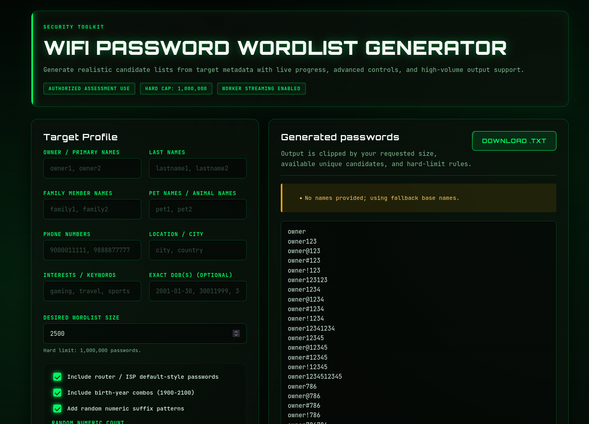
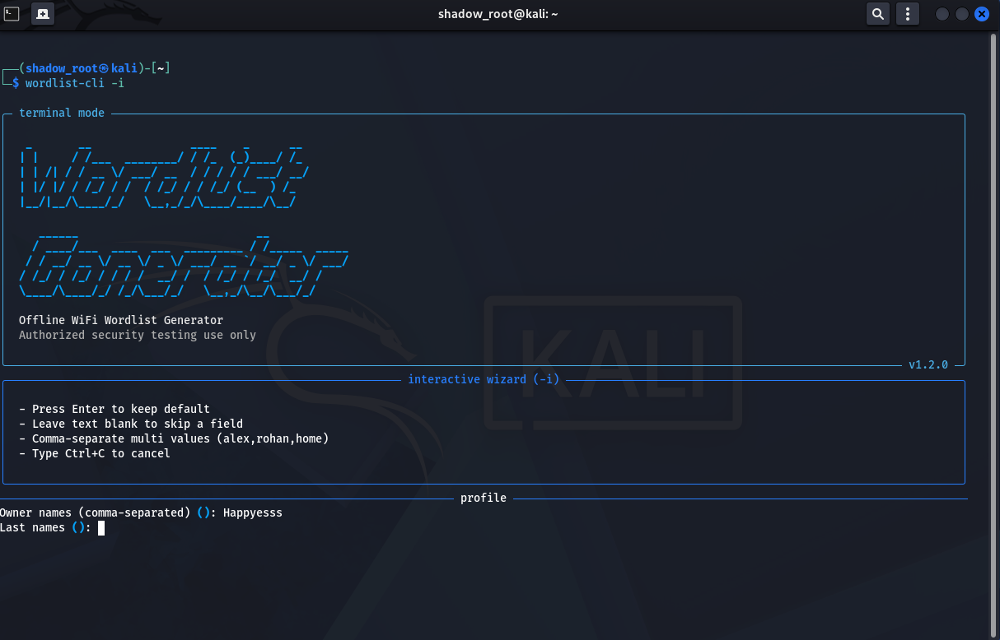

# WiFi Password Wordlist Generator

A browser-based wordlist generator for authorized security assessments. It builds realistic candidate passwords from profile information (names, DOB, phone numbers, interests, locations, pet names, and optional random numeric suffixes).

## Important Notice

Use this tool only on networks and assets you are authorized to test. Unauthorized use may be illegal.

## Features

- Hacker-style dark UI with responsive dashboard layout.
- Modular JavaScript architecture.
- Supports large lists with hard limit enforcement (up to 1,000,000).
- Worker-based generation path for high-volume requests.
- Cancel running worker tasks.
- Multiple candidate sources:
  - Primary names
  - Last names
  - Family names
  - Pet names
  - Phone numbers
  - Locations
  - Interests
  - Exact DOB values
  - Router default patterns
  - Year-based combinations
  - Optional random numeric suffixes
- Dual download buttons:
  - Main form action area
  - Generated-password output area

## Screenshots

Web UI:



CLI UI:



## Project Structure

- index.html: Main page layout and controls.
- styles.css: Hacker-theme styling and responsive rules.
- js/app.js: App entrypoint, event handling, worker orchestration.
- js/constants.js: Limits, defaults, constants.
- js/utils.js: Input normalization and validation helpers.
- js/generator.js: Core candidate-generation engine.
- js/ui.js: UI state updates and download handling.
- js/worker.js: Background generation worker with chunk streaming.

## How Generation Works

1. Inputs are normalized and sanitized.
2. Candidate base tokens are collected from provided fields.
3. Variations are generated using:
   - Case transforms (lower/capital/upper)
   - Numeric and symbolic suffixes
   - Name pair combinations
   - Location and interest combinations
   - Year-based combinations (optional)
   - Exact DOB variants (optional)
   - Random numeric suffixes (optional)
4. Candidates are deduplicated.
5. Final output is clipped by:
   - Requested size
   - Available unique candidates
   - Hard limit (1,000,000)

## Performance Behavior

- For smaller requests, generation runs inline.
- For larger requests, generation runs in a Web Worker.
- Worker mode streams output chunks to keep UI responsive.
- Cancel button terminates active worker generation.

## Input Guide

- Owner / Primary names: Comma-separated values.
- Last names: Comma-separated values.
- Family member names: Comma-separated values.
- Pet names / animal names: Comma-separated values.
- Phone numbers: Comma-separated numeric values.
- Location / city: Comma-separated values.
- Interests / keywords: Comma-separated values.
- Exact DOB(s): Flexible input formats accepted; cleaned into numeric forms.
- Desired wordlist size: Minimum 100, maximum 1,000,000.
- Include router defaults: Adds common router/ISP-style candidates.
- Include birth-year combos: Uses 1900 to 2100 year variations.
- Add random numeric suffix patterns: Enables extra random numeric endings.
- Random numeric count: Number of random suffixes to generate (0 to 200).

## Offline Terminal CLI (Kali)

You can install a global command directly from the repo link and run it like Cupp.

Install with repo link:

```bash
pipx install "git+https://github.com/Happyesss/wordlist-genrator.git"
```

Run interactive mode:

```bash
wordlist -i
```

If already installed, upgrade to latest UI build:

```bash
pipx reinstall "git+https://github.com/Happyesss/wordlist-genrator.git"
```

Quick update command (recommended):

```bash
pipx install --force "git+https://github.com/Happyesss/wordlist-genrator.git@main"
```

Show complete help:

```bash
wordlist -help
```

Notes:

- If `pipx` is missing: `sudo apt update && sudo apt install -y pipx`
- Then run `pipx ensurepath` and restart terminal.

## Usage Flow

1. Enter known target details.
2. Choose generation options.
3. Click Generate Wordlist.
4. Monitor warnings and stats.
5. If needed, click Cancel during long runs.
6. Download using either download button.

## Troubleshooting

- Download button disabled:
  - Generate a list first.
- Worker not running:
  - Ensure modern browser support and served over local HTTP.
- Output lower than requested:
  - Candidate space may be smaller than requested size.
- Requested value clipped:
  - Value exceeded hard limit or available unique candidates.
- CLI layout looks messy in a small terminal:
  - Increase terminal width when possible.
  - The CLI now auto-switches to a compact header on narrow terminals.
  - Use `--quiet` for minimal output in very small terminal windows.

## Security and Privacy Notes

- The app runs in-browser and does not send data by default.
- Avoid sharing generated wordlists publicly.
- Store outputs securely and delete when assessment is complete.

## Future Improvements

- Export options (txt/csv/json).
- Advanced rules preset profiles.
- Optional reproducible random seed for random suffix generation.
- Progressive pagination for very large outputs.
